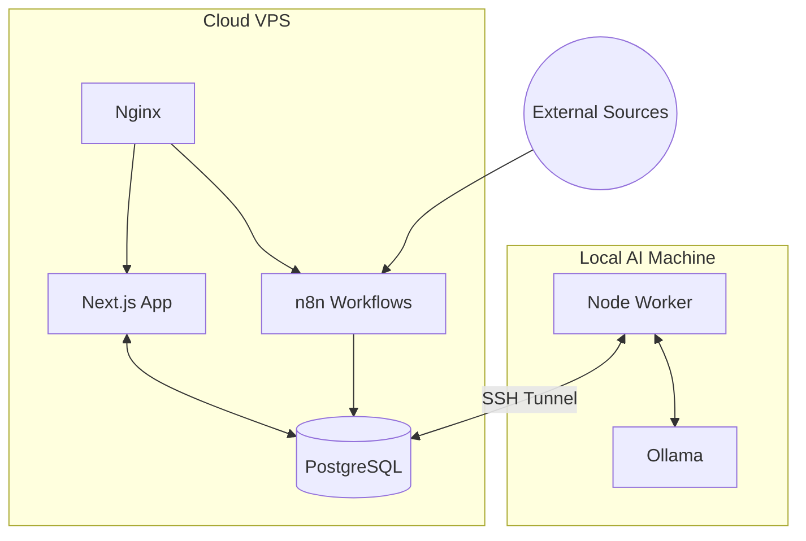

# radarX

Private opportunity intelligence platform built with `Next.js 15`, `PostgreSQL`, `Prisma`, and a hybrid local-AI pipeline.

[Live Demo](http://radarX.mooo.com)

## Overview

radarX is a self-hosted system for discovering, scoring, reviewing, and routing high-signal opportunities from external sources.

The product is split into two layers:

- A public landing experience that explains the system and gates access.
- A protected operator workspace for reviewing opportunities, monitoring workflow health, and managing user access.

The main engineering goal is cost-efficient automation: ingestion runs in the cloud, while heavier AI classification can be offloaded to a local machine running `Ollama` through a secure tunnel.

## Highlights

- Owner-approved access flow with email/password and Google OAuth login
- Protected dashboard for reviewing opportunities and workflow activity
- Search, filtering, pagination, scoring, and review states
- PostgreSQL-backed data model with Prisma
- Hybrid cloud/local AI processing design for lower inference cost
- Self-hosted workflow integration with `n8n`

## Architecture



## Stack

- Frontend: `Next.js 15`, `React 19`, `Tailwind CSS`, `Framer Motion`
- Backend: `Next.js App Router`, server actions, route handlers
- Data: `PostgreSQL`, `Prisma`, `pg`
- Auth: custom session handling with `jose`, password hashing with `bcryptjs`, Google OAuth
- Automation: `n8n`, local AI worker, `Ollama`
- Deployment: `Docker`, `Nginx`, VPS hosting

## Security Notes

- Secrets are expected through environment variables and are not stored in source control.
- Production auth bypass is disabled by design.
- Password reset tokens are hashed before storage.
- Google OAuth uses `state` validation.
- Basic auth rate limiting is applied to login and recovery flows.

## Local Setup

1. Install dependencies.
2. Copy `.env.example` to a local env file.
3. Set `DATABASE_URL`, `AUTH_SECRET`, and any OAuth/SMTP values you need.
4. Generate Prisma client and start the app.

```bash
npm install
npm run db:generate
npm run build
npm run dev
```

## Environment Variables

The main variables used by the app are:

- `APP_URL`
- `DATABASE_URL`
- `AUTH_SECRET`
- `OWNER_BOOTSTRAP_EMAIL`
- `DEV_AUTH_BYPASS`
- `GOOGLE_CLIENT_ID`
- `GOOGLE_CLIENT_SECRET`
- `SMTP_HOST`
- `SMTP_PORT`
- `SMTP_USER`
- `SMTP_PASS`
- `EMAIL_FROM`

## Repository Notes

- This public repository is intended to showcase product direction, architecture, and implementation quality.
- Local-only secrets, deployment env files, and machine-specific scripts are intentionally excluded from source control.

## Status

Active portfolio project. The current repo focuses on the application, auth flow, operator dashboard, and core data pipeline foundation.
