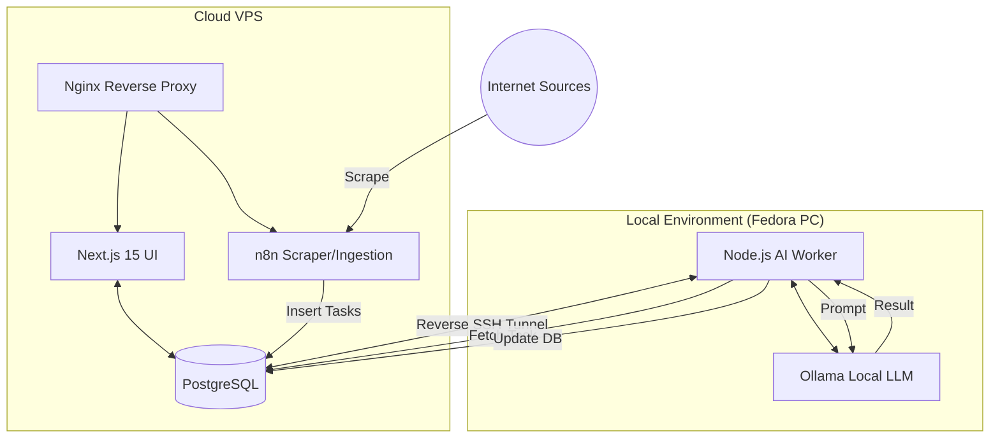

# 🎯 Opportunity Radar (radarX)

**A Hybrid-Cloud AI Intelligence & Routing Platform.**

 

### 🌐 Live Demo: [radarX.mooo.com](http://radarX.mooo.com)

 

## 🌟 Overview (The Problem & Solution)

**Opportunity Radar (radarX)** is a distributed intelligence platform that automates the ingestion, scoring, and routing of high-value opportunities from across the web. 

**The Problem:** Using cloud-based LLMs (like OpenAI) for high-volume data classification is prohibitively expensive and introduces rate-limiting bottlenecks.

**The Solution:** I engineered a hybrid-cloud architecture. Data is ingested on a VPS via `n8n`, but the heavy AI inference is securely offloaded to a local machine running `Ollama` via a reverse SSH tunnel. 

**Business Impact:** This architecture reduces AI API costs by an estimated 80-100% while maintaining complete data privacy and sub-second response times for the Next.js operator dashboard.

---

## 🏗️ Architecture & Engineering Decisions

### 1. Hybrid-Cloud AI Pipeline (Cost Optimization)
Instead of processing thousands of scraped items through paid APIs, a custom Node.js worker runs on a local Fedora machine. It connects to the VPS PostgreSQL database via a secure SSH tunnel, leases pending classification tasks, processes them locally using `Ollama`, and writes the validated results back to the cloud.

### 2. Event-Driven Ingestion (Automation)
Self-hosted `n8n` instances act as the nervous system, continuously scraping data from target platforms, formatting the payloads, and inserting them into the AI queue table.

### 3. High-Performance Dashboard (Full Stack)
The operator interface is built with Next.js 15 (App Router) and Tailwind CSS, featuring dark-mode optimization, stateless JWT authentication (`jose`, `bcryptjs`), and real-time status monitoring of the AI workers and data sources.

---

## ✨ Key Features

- **🧠 Distributed AI Workers:** Local LLM execution with queue management and leasing to prevent race conditions.
- **⚡ Automated Ingestion Hooks:** Deep `n8n` integration for continuous, headless data aggregation.
- **🛡️ Stateless Security:** Custom JWT auth with strict Role-Based Access Control (RBAC). Users require manual admin approval.
- **📊 Operator Command Center:** A sleek UI to review scored opportunities, track workflow health, and monitor system latency.

---

## 🛠️ Technology Stack & Deployment

- **Infrastructure:** VPS (Ubuntu), Docker, Nginx Reverse Proxy, SSH Tunnels.
- **Backend & Database:** Node.js, Next.js Server Actions, PostgreSQL (managed via Prisma ORM).
- **Frontend:** Next.js 15, React 19, Tailwind CSS.
- **AI & Automation:** `Ollama` (Local LLMs), `n8n` (Workflow Automation).

*The platform is containerized using Docker, with Nginx handling SSL termination and reverse proxy routing on the production VPS.*

---

  <i>Engineered for high-signal intelligence and cost-effective automation.</i>

